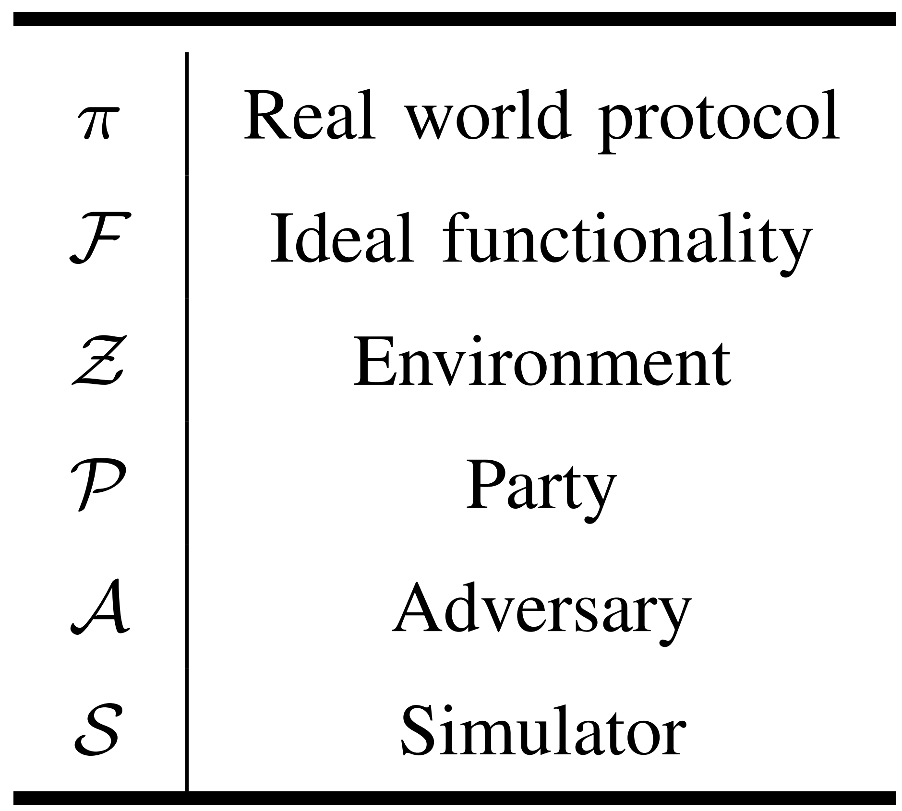
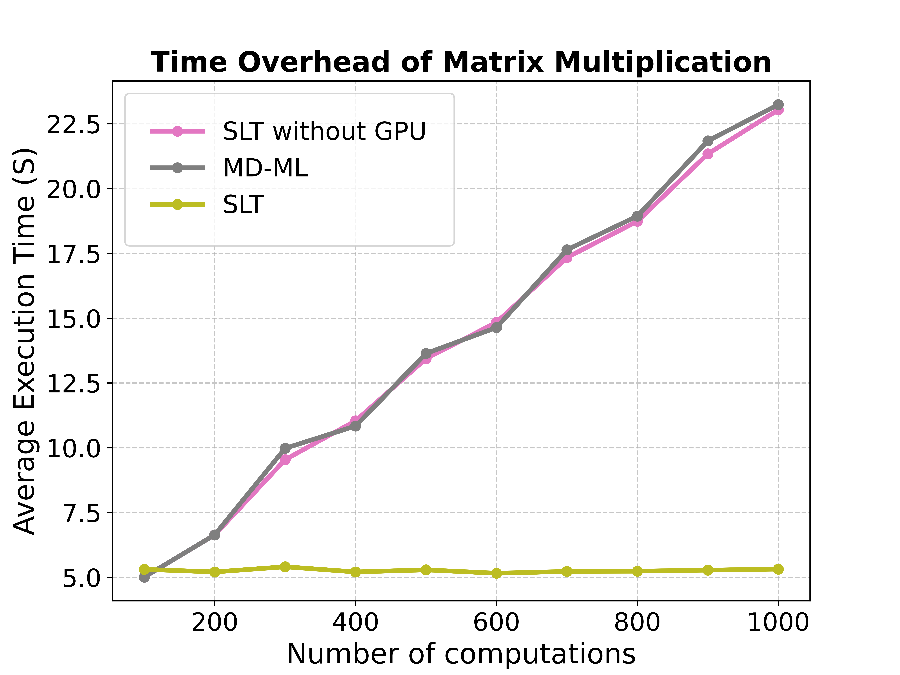
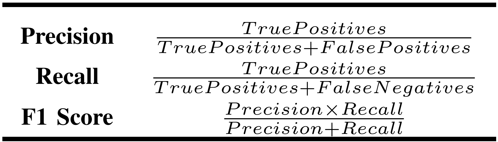
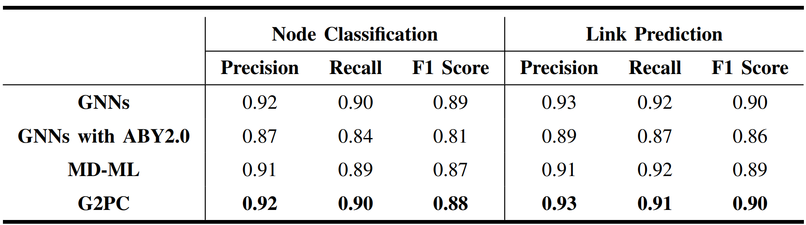
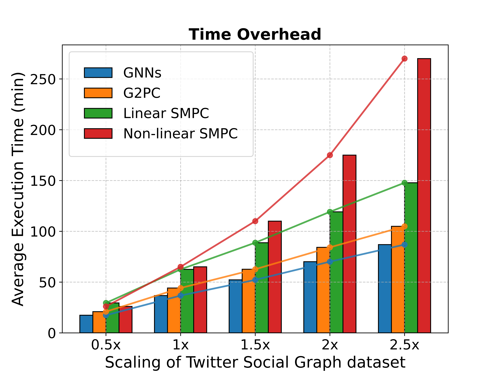
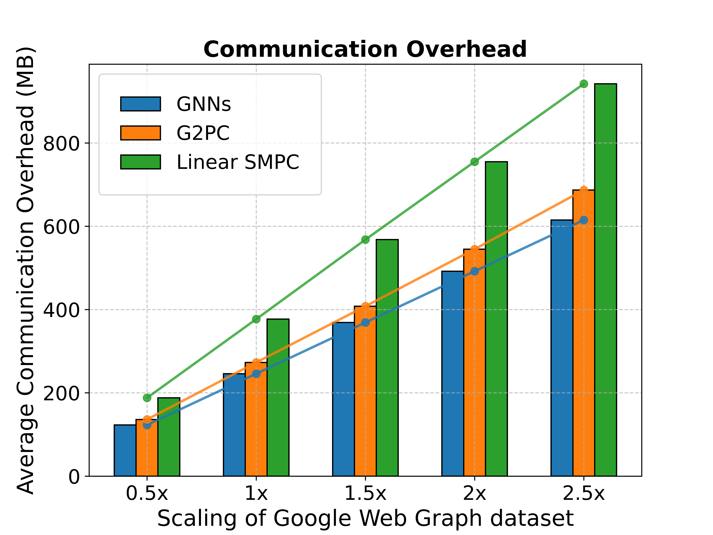
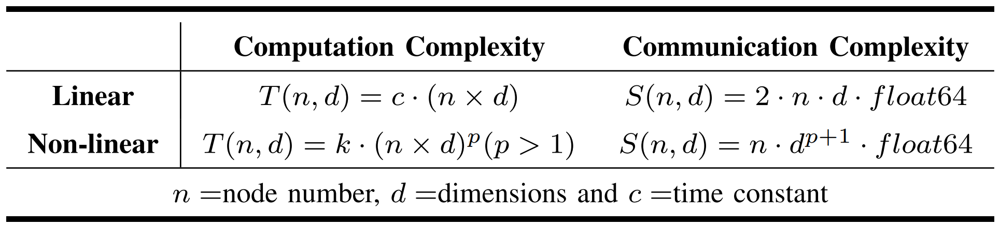

## C2: Security Proof (812A, 812D)
#### Table 1. Symbol Description of UC framework

## 812A_Response
#### Existing Work
[1] S. Wang, Y. Zheng, and X. Jia, "Secgnn: Privacy-preserving graph neural network training and inference as a cloud service," IEEE Transactions on Services Computing, vol. 16, no. 4, pp. 2923–2938, 2023.

[2] R. Ran, N. Xu, T. Liu, W. Wang, G. Quan, and W. Wen, "Penguin: Parallel-packed homomorphic encryption for fast graph convolutional network inference," in Advances in Neural Information Processing Systems, A. Oh, T. Naumann, A. Globeron, K. Saenko, M. Hardt, and S. Levine, Eds., vol. 36. Curran Associates, Inc., 2023, pp. 19104–19116. Available: https://proceedings.neurips.cc/paper_files/paper/2023/file/3cc685788a31f1a35d8d41df93e288ca-Paper-Conference.pdf

[3] H. Wang, S. Cai, P. Liu, J. Zhang, Z. Shen, and K. Liu, "Dp-stgat: Traffic statistics publishing with differential privacy and a spatial-temporal graph attention network," Inf. Sci., vol. 623, no. C, pp. 258–274, Apr 2023. Available: https://doi.org/10.1016/j.ins.2022.11.053

### New Comparison Experiment

#### Time Overhead

#### Memory Overhead

#### Communication Overhead

## 812B_Response

#### Table 2. New Accuracy Metrics

#### Table 3. Accuracy Results

## 812C_Response

#### Table 4. Overheads on Existing Work

#### Computation Improvement

#### Communication Improvement

## 812D_Response
### Experiments on Large-datasets

#### Table 5. Computational and Communication Complexity

#### Computation Improvement

#### Communication Improvement

